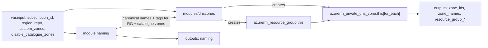

# Data Model — Private DNS Zones (prd-hub-only)

This feature has no persistent application data model; the "data" is Terraform-state-managed Azure resources and a small set of in-memory locals/outputs. The entities below are the Terraform / engine objects that flow through the stack.

## Entities

### Catalogue entry

- **Source**: `local.catalogue` in `modules/dnszones/locals.tf` — a single `map(string)`.
- **Fields**:
  - `key` (string, primary key): lowercase alphanumeric + hyphen, length 2..16 (engine purpose-token regex). Day-one keys enumerated in [spec.md § FR-011](spec.md).
  - `fqdn` (string, value): the Microsoft-published private-link FQDN this key represents.
- **Invariants**:
  - Keys MUST be unique within the catalogue (FR-012).
  - Keys MUST match the engine purpose-token regex (FR-007).
  - FQDNs MUST be unique within the catalogue (no two keys share a value).
- **Lifecycle**: const local; mutated only via PR to `modules/dnszones/locals.tf`.

### Custom zone entry

- **Source**: `var.custom_zones` (`list(string)`) on `terraform/dns/`.
- **Fields**:
  - `fqdn` (string, both key and value): a DNS-valid FQDN supplied by the operator.
- **Invariants**:
  - Each FQDN MUST match the FQDN regex (FR-016, research § 7).
  - Each FQDN MUST NOT shadow any catalogue FQDN (FR-017).
  - No duplicates within the list (FR-019).
- **Lifecycle**: per-stack tfvars; survives across plans; `for_each` key is the FQDN string, so reordering is a no-op.

### Disable entry

- **Source**: `var.disable_catalogue_zones` (`list(string)`) on `terraform/dns/`.
- **Fields**:
  - `key` (string): a catalogue key to exclude.
- **Invariants**:
  - Each key MUST be a member of `keys(local.catalogue)` (FR-018).
  - No duplicates within the list (FR-019).
- **Lifecycle**: per-stack tfvars; adding/removing a key produces exactly one destroy/create (SC-004 / SC-003).

### Engine name record (catalogue zones only)

- **Source**: `module.naming.names["pdnsz-<key>-hub-prd-<region_code>-001"]` for every catalogue key NOT in `disable_catalogue_zones`. Custom zones do NOT appear here (OQ-001 → B).
- **Fields**: standard engine record (11 fields) per feature 001 [contracts/output-schema.md](../001-naming-convention-engine/contracts/output-schema.md). Notable values for this stack:
  - `service_type = "private_dns_zone"`
  - `topology = "hub"`, `tenant = "hub"`, `environment = "prd"`
  - `purpose = "<catalogue_key>"`
  - `parent = null`
  - `resource_group = "rg-hub-prd-<region_code>-001"`
  - `tags` = engine baseline 6 keys (no per-name overrides in v1; FR-015 forbids them)
  - `defaults = { soa_record_email = null }` (research § 2)
- **Lifecycle**: regenerated on every plan; deterministic.

### Per-stack resource group

- **Source**: `azurerm_resource_group.this` in `modules/dnszones/main.tf`.
- **Fields**:
  - `name = module.naming.names["rg-hub-prd-<region_code>-001"].canonical_name`
  - `location = var.region`
  - `tags = module.naming.names["rg-hub-prd-<region_code>-001"].tags`
- **Invariants**: exactly ONE per stack (FR-035); name comes from the engine (FR-009).

### Zone resource (catalogue ∪ custom)

- **Source**: `azurerm_private_dns_zone.this` (`for_each` keyed per research § 4).
- **Fields**:
  - `for_each` key = catalogue key OR custom FQDN.
  - `name` = the FQDN (always — for catalogue, looked up via `local.catalogue[each.key]`; for custom, the key IS the FQDN).
  - `resource_group_name = azurerm_resource_group.this.name`.
  - `tags` = catalogue → engine baseline + (no override); custom → module-internal baseline derived from `var.input` (research § 8 of plan.md Constitution VIII note).
- **Invariants**:
  - Per FR-025: `for_each` keys are catalogue key / custom FQDN, never list index.
  - Per FR-024: output-key choice equals `for_each` key.

### Stack outputs

| Output | Type | Key shape |
|---|---|---|
| `zone_ids` | `map(string)` | catalogue key for catalogue entries, FQDN for custom entries |
| `zone_names` | `map(string)` | same key shape as `zone_ids`; value is always the FQDN |
| `resource_group_name` | `string` | scalar |
| `resource_group_id` | `string` | scalar |
| `naming` | passthrough of `module.naming.names` | engine canonical-name key |

## Relationships

## State transitions

- **First apply** (clean subscription): RG created → all enabled catalogue zones created → all custom zones created. Snapshot matches reference.
- **Re-plan unchanged input**: zero diff (FR-026 / SC-002).
- **Add custom zone**: `merge()` for_each gets one new key → one create (FR-027 / SC-003).
- **Reorder custom zones**: zero diff (set semantics via for_each).
- **Add disable key**: `merge()` for_each drops one key → one destroy (SC-004).
- **Catalogue PR adds a zone**: new `local.catalogue` entry → one create (after engine snapshot regen).
- **Catalogue PR removes a zone**: `local.catalogue` entry removed → one destroy (subject to operator approval per FR-033).

## No application data, no DB schema, no record CRUD

Zones are containers; record sets are managed by consumers (FR-004). The data model ends at the zone resource.
